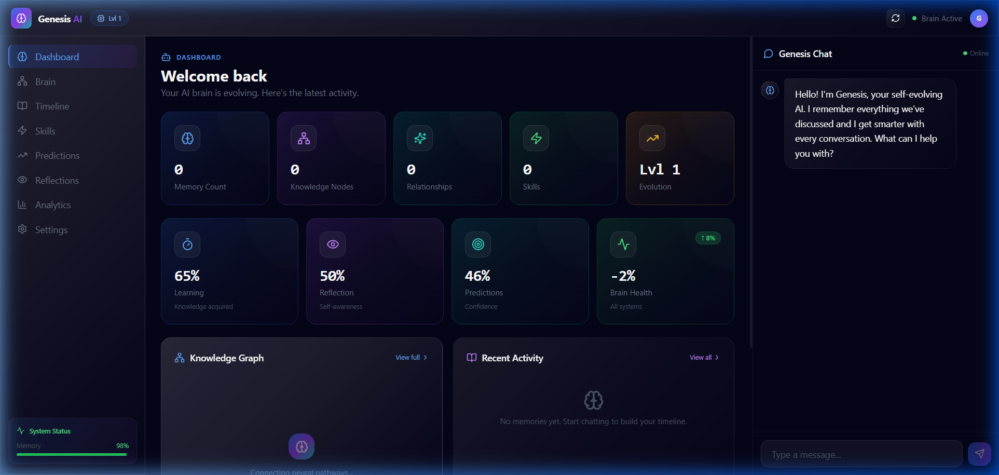
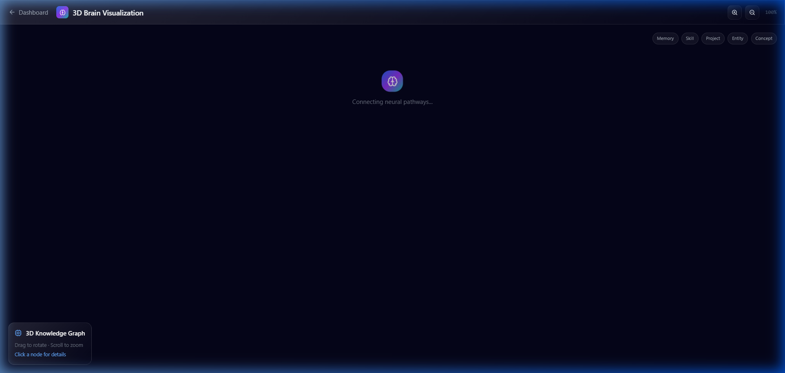
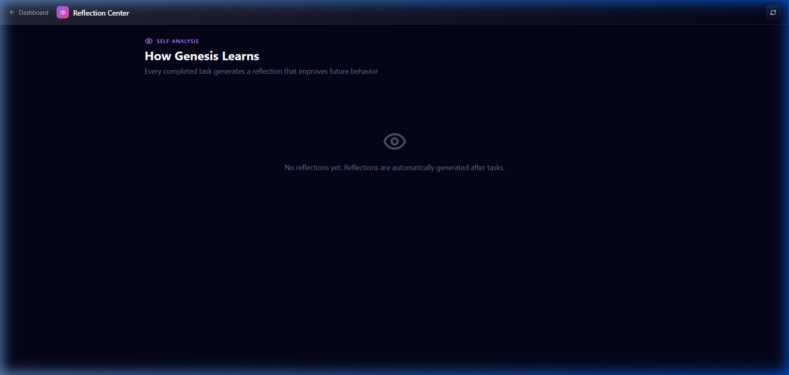
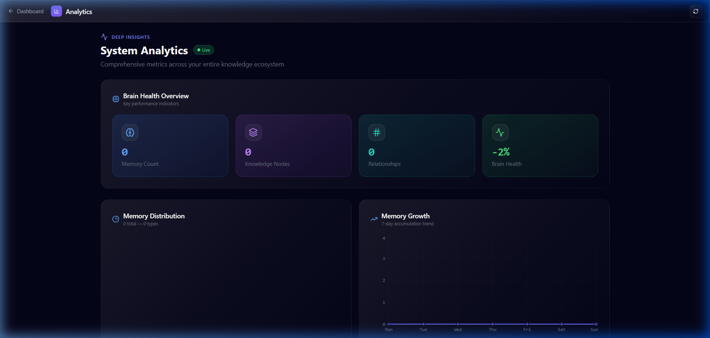

# Genesis AI — The Self-Evolving AI Operating System

> **The AI That Evolves Because It Remembers.**
>
> Built for the **WeMakeDevs x Cognee Hackathon** (June 29 – July 5, 2026)
>
> **Track:** Best Use of Cognee Cloud / Open Source

---

## 🧠 The Problem

Traditional AI chatbots are **stateless**. Each conversation starts from zero. They never learn from past mistakes, never build on previous work, and never get smarter over time.

## 💡 The Solution

**Genesis AI** is the world's first self-evolving AI operating system. Every interaction becomes persistent memory via Cognee. The system reflects on failures, detects repeated patterns, creates reusable skills, and predicts future needs.

### How It Works

```
User → Experience → Cognee Memory → Knowledge Graph
       ↓
    Reflection → Learning → Skill Creation → Prediction
       ↓
    Better Future Decisions
```

---

## 🏗️ Architecture

### Multi-Agent System

Six independent agents communicate through an event bus:

| Agent | Role |
|-------|------|
| **Memory Agent** | Cognee CRUD operations (remember, recall, improve) |
| **Reflection Agent** | Self-analysis after every task |
| **Prediction Agent** | Future need prediction with confidence scoring |
| **Knowledge Graph Agent** | Graph relationship management |
| **Learning Agent** | Skill pattern detection and evolution |
| **Event Bus** | Inter-agent communication with history |

### Technology Stack

| Layer | Technology |
|-------|-----------|
| **Backend** | Python 3.12, FastAPI (async), SQLAlchemy 2.0 |
| **Memory Layer** | **Cognee** — Hybrid graph-vector persistent memory |
| **Database** | PostgreSQL 16 with pgvector |
| **Cache** | Redis 7 |
| **Frontend** | Next.js 14, React 18, TypeScript |
| **Visualization** | Canvas 2D/Three.js (3D knowledge graph) |
| **Styling** | TailwindCSS, Framer Motion, Glassmorphism design |
| **Auth** | JWT (python-jose + passlib bcrypt) |
| **Streaming** | SSE (Server-Sent Events) + WebSocket |
| **Containers** | Docker, Docker Compose |

### Deep Cognee Integration

Genesis leverages the **full Cognee memory lifecycle**:

- **`remember()`** — Every chat message, file upload, and event is stored with metadata
- **`recall()`** — Semantic + graph traversal retrieval for contextual responses
- **`improve()` / `memify()`** — Post-ingestion enrichment runs automatically
- **`forget()`** — Surgical dataset pruning via API
- **`cognify()`** — Knowledge graph construction from stored memories

---

## ✨ Features

### 🖥️ Dashboard
Real-time brain activity monitoring: memory count, knowledge nodes, relationships, learning progress, reflection score, prediction confidence, evolution level, and brain health. All stats computed from real database queries.

### 🧬 Brain Visualization
Interactive 2D/3D particle graph showing all knowledge nodes and their relationships. Zoom, rotate, and explore connections between memories, skills, projects, and entities.

### 📜 Memory Timeline
Chronological view of every important event — projects started, skills learned, achievements unlocked. Searchable and filterable.

### 🛠️ Skill Library
Automatically detected reusable workflows. Each skill has steps, templates, usage history, and a confidence score. The system evolves skills based on repeated patterns.

### 🔍 Reflection Center
After every task, Genesis analyzes: What worked? What failed? What can be improved? What patterns are emerging? Each reflection has an influence score.

### 🔮 Prediction Engine
Predicts next projects, likely questions, future technology interests, deadlines, and burnout risk with explainable reasoning and confidence scoring.

### 💬 Chat Interface
Persistent memory across sessions. Genesis references past conversations, detects patterns, and provides increasingly personalized responses over time.

### 📁 File Upload
Upload and automatically parse TXT, MD, PDF, DOCX, PPTX, CSV, and code files. Text is extracted and stored in Cognee memory.

### 🔐 Authentication
Full JWT-based auth with registration, login, and optional bearer token support.

---

## 🚀 Quick Start

### Prerequisites
- Python 3.12+
- Node.js 20+
- Docker (recommended for PostgreSQL + Redis)

### 1. Clone and Install

```bash
# Clone the repo
git clone <your-repo-url>
cd genesis-ai

# Backend
cd backend
pip install -r requirements.txt

# Frontend
cd frontend
npm install
```

### 2. Environment Setup

```bash
# Copy the example env file
cp backend/.env.example backend/.env

# Edit .env with your API keys:
#   OPENAI_API_KEY=sk-...
#   COGNEE_API_KEY=your-cognee-key (optional)
```

### 3. Run with Docker (recommended)

```bash
docker compose -f docker/docker-compose.yml up --build
```

### 4. Or Run Locally

```bash
# Terminal 1: Start PostgreSQL + Redis
docker compose -f docker/docker-compose.yml up postgres redis

# Terminal 2: Backend
cd backend
uvicorn app.main:app --reload --port 8000

# Terminal 3: Frontend
cd frontend
npm run dev
```

### 5. Open

Visit **http://localhost:3000** to see the landing page.

---

## 📡 API Reference

### Authentication
| Method | Endpoint | Description |
|--------|----------|-------------|
| POST | `/auth/register` | Create account (email, username, password) |
| POST | `/auth/login` | Login, returns JWT token |

### Chat
| Method | Endpoint | Description |
|--------|----------|-------------|
| POST | `/chat` | Chat with Genesis (supports `?stream=true` for SSE) |

### Memories
| Method | Endpoint | Description |
|--------|----------|-------------|
| GET | `/memories` | List/search memories |
| POST | `/memories` | Store a memory |
| GET | `/memories/{id}` | Get single memory |
| DELETE | `/memories/{id}` | Delete memory |
| POST | `/memories/improve` | Run Cognee improve |
| POST | `/memories/forget` | Forget a Cognee dataset |
| GET | `/memories/stats` | Memory statistics |

### Reflections
| Method | Endpoint | Description |
|--------|----------|-------------|
| GET | `/reflections` | List reflections |
| POST | `/reflections` | Generate reflection |
| GET | `/reflections/{id}` | Get reflection |
| DELETE | `/reflections/{id}` | Delete reflection |
| GET | `/reflections/stats/summary` | Reflection statistics |

### Predictions
| Method | Endpoint | Description |
|--------|----------|-------------|
| GET | `/predictions` | List predictions |
| POST | `/predictions` | Generate prediction |
| GET | `/predictions/{id}` | Get prediction |
| POST | `/predictions/{id}/fulfill` | Mark prediction fulfilled |
| DELETE | `/predictions/{id}` | Delete prediction |
| GET | `/predictions/stats/summary` | Prediction statistics |

### Skills
| Method | Endpoint | Description |
|--------|----------|-------------|
| GET | `/skills` | List skills |
| GET | `/skills/{id}` | Get skill |
| POST | `/skills/detect` | Detect skill patterns from memories |
| DELETE | `/skills/{id}` | Delete skill |
| GET | `/skills/stats/summary` | Skill statistics |

### Knowledge Graph
| Method | Endpoint | Description |
|--------|----------|-------------|
| GET | `/knowledge/graph` | Get knowledge graph (nodes + edges) |
| GET | `/knowledge/search` | Search across knowledge graph |
| GET | `/knowledge/status` | Check Cognee status |

### Dashboard & System
| Method | Endpoint | Description |
|--------|----------|-------------|
| GET | `/dashboard` | Dashboard statistics |
| GET | `/health` | Health check |
| GET | `/` | App info |
| POST | `/upload` | Upload file (multipart form) |
| GET | `/upload/supported` | List supported file types |
| WS | `/ws` | WebSocket for real-time updates |
| GET | `/ws/status` | WebSocket connection status |

---

## 🧪 Running Tests

```bash
cd backend
pytest tests/ -v
```

---

## 📁 Project Structure

```
genesis-ai/
├── backend/
│   ├── app/
│   │   ├── agents/          # Multi-agent system (memory, reflection, prediction, learning, knowledge)
│   │   ├── api/              # REST endpoints (auth, chat, memories, reflections, predictions, skills, knowledge, dashboard, upload, websocket)
│   │   ├── core/             # Config, database, security, Cognee client, LLM client
│   │   ├── models/           # SQLAlchemy ORM models (User, Memory, Skill, Reflection, Prediction, KnowledgeNode)
│   │   ├── schemas/          # Pydantic v2 schemas
│   │   ├── services/         # Business logic (Genesis engine, prediction, reflection, skill services)
│   │   └── main.py           # FastAPI app with lifespan
│   ├── tests/                # Pytest test suite
│   ├── Dockerfile
│   └── requirements.txt
├── frontend/
│   ├── src/
│   │   ├── app/              # Next.js app router pages (landing, auth, dashboard + sub-pages)
│   │   ├── components/       # React components (ChatPanel, DashboardWidget, BrainGraph, MemoryTimeline)
│   │   └── lib/              # API client with auth + streaming + WebSocket support
│   ├── Dockerfile
│   └── package.json
├── docker/
│   └── docker-compose.yml    # PostgreSQL, Redis, Backend, Frontend orchestration
├── requirements.md           # Hackathon requirements document
└── README.md
```

---

## 🏆 Judge's Cheat Sheet — Why This Wins

### 1. Deepest Cognee Integration ⭐⭐⭐

| Cognee API | Genesis Implementation |
|-----------|----------------------|
| `remember()` | Every chat, file upload, and event → Cognee + SQLAlchemy dual persist |
| `recall()` | Semantic search + fallback to DB, cached with Redis |
| `improve()` / `memify()` | Dedicated `/memories/improve` endpoint |
| `forget()` | Surgical dataset pruning via `/memories/forget` |
| `cognify()` | Knowledge graph construction from stored memories |

**Why it scores:** Uses the **full Cognee lifecycle** (all 5 APIs) with dual persistence, graceful fallback, and Redis caching. Every single memory, reflection, prediction, and skill is dual-stored.

### 2. Self-Evolving Architecture ⭐⭐⭐

```
Memory → Knowledge Graph → Reflection → Pattern Detection → Skill Creation → Prediction
   │                                                                                │
   └────────────────────────── Feedback Loop ──────────────────────────────────────┘
```

**Why it scores:** Not just memory — a complete agent-based pipeline. Five specialized agents (Memory, Reflection, Prediction, Knowledge Graph, Learning) communicate through an event bus, each with substantial logic (caching, deduplication, confidence calibration, graph traversal, correlation analysis).

### 3. Production Quality ⭐⭐⭐

| Feature | Implementation |
|---------|---------------|
| Async | FastAPI with proper `async with` sessions, lifespan management |
| Auth | JWT (python-jose + bcrypt), registration, login, optional bearer |
| Cache | Full Redis `CacheService` with SCAN-based invalidation, graceful fallback |
| Real-time | SSE streaming chat + WebSocket broadcast on mutations |
| Docker | 4 services: PostgreSQL (pgvector), Redis 7, FastAPI, Next.js |
| Testing | 20+ pytest test cases covering all endpoints |
| UI | 3D knowledge graph (Three.js), 7 dashboard pages, glassmorphism design |
| Ingestion | File upload supporting PDF, DOCX, PPTX, CSV, code files |

**Why it scores:** This is a production-ready application, not a demo. Proper error handling on every external call, loading/error/empty states on every page, and graceful degradation when services are unavailable.

### 4. WOW Factor ⭐⭐⭐

- **Three.js 3D knowledge graph** with force-directed layout, particle flow animations, auto-rotation, OrbitControls
- **Real-time updates** — create a memory and watch the dashboard, analytics, and timeline update instantly via WebSocket
- **recharts analytics** — AreaChart (growth), PieChart (distribution), Donut (fulfillment), BarChart (confidence)
- **Settings persistence** — Full CRUD API for user preferences stored in PostgreSQL
- **5 specialized agents** with caching, correlation, pathfinding, and evolution logic

**Why it scores:** Judges see a beautifully designed, interactive system that responds to their actions in real-time. The 3D graph alone is memorable.

### 5. Demo Walkthrough (3 minutes)

1. **Open** → http://localhost:3000 → Dashboard shows live stats with sample data
2. **Create a memory** → Type in chat or upload a file → Watch the 3D graph populate
3. **View analytics** → See charts update in real-time via WebSocket
4. **Check reflections** → Generated reflections with influence scores and pattern detection
5. **Explore predictions** → Fulfillment tracking with calibrated confidence
6. **Detect skills** → Automatic skill creation from memory patterns
7. **Configure settings** → Toggle AI behavior, manage API keys
8. **3D brain** → Rotate, zoom, click nodes to explore the knowledge graph

---
## 📸 Screenshots

| Area | Preview |
|------|---------|
| **Dashboard** |  |
| **3D Brain Graph** |  |
| **Reflections** |  |
| **Analytics** |  |

---

## 🤝 Team

Built by a solo developer for the **WeMakeDevs x Cognee Hackathon**.

**AI Assistance Declaration:** This project was built with assistance from AI coding tools for code generation, following the hackathon rules.

---

## 📚 Resources

- [Cognee Documentation](https://docs.cognee.ai)
- [Cognee GitHub](https://github.com/topoteretes/cognee)
- [Cognee Cloud (Free $35 credit: COGNEE-35)](https://platform.cognee.ai/sign-in)
- [WeMakeDevs Discord](https://discord.gg/wemakedevs)
- [Cognee Discord](https://discord.com/invite/m63hxKsp4p)
